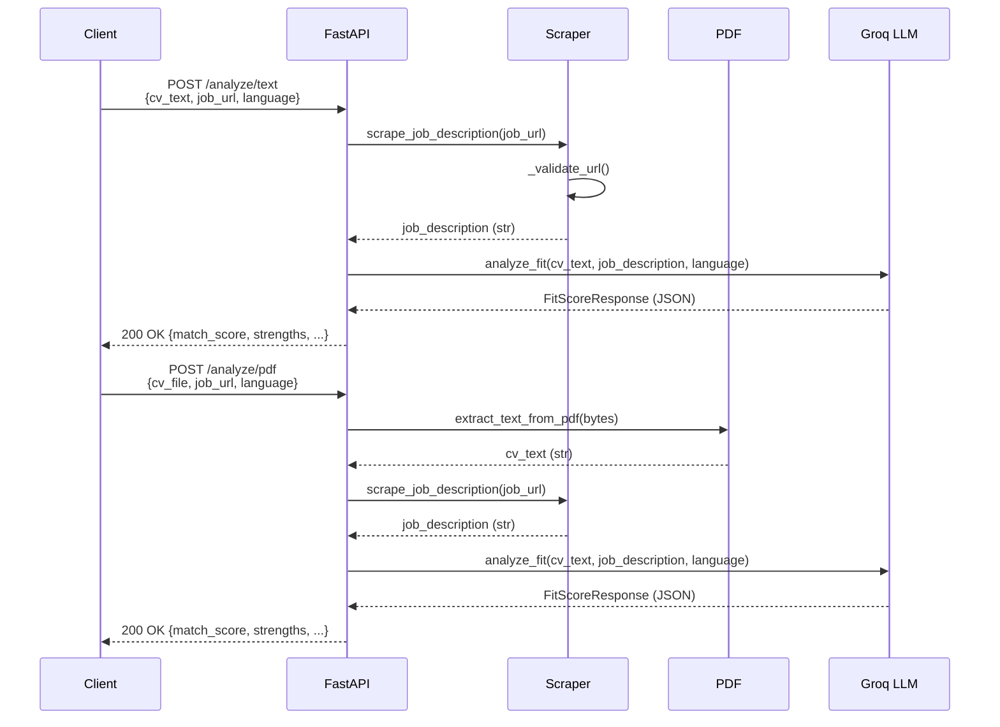
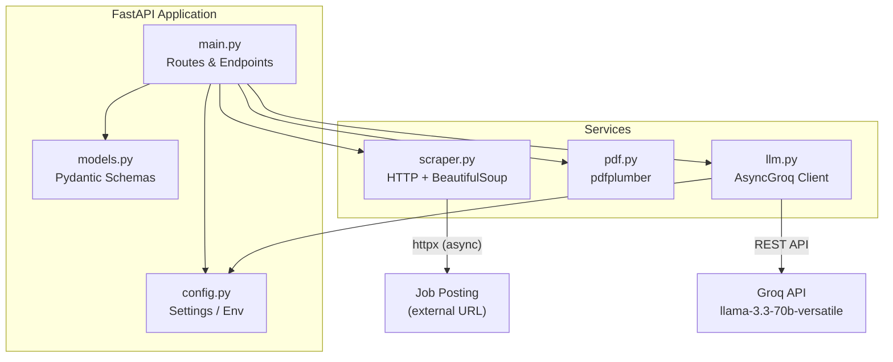
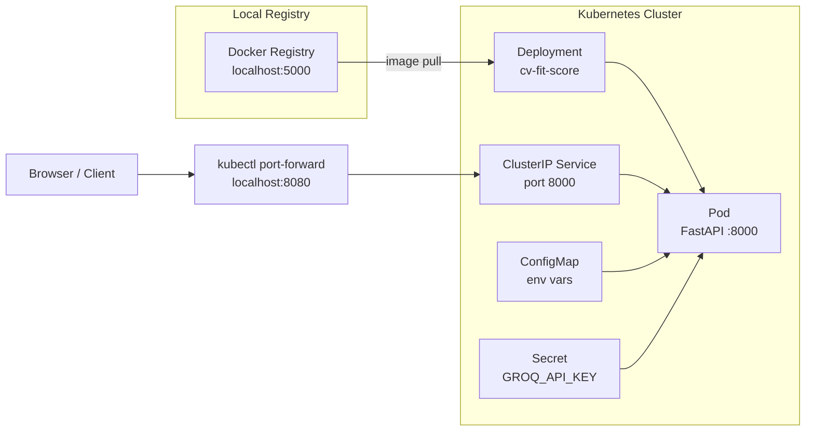

# CV Fit Score

AI-powered API that analyzes a CV against a job description and returns a structured fit score.

Built with **FastAPI**, **Groq** (llama-3.3-70b-versatile), **pdfplumber**, and deployed via **Docker** / **Kubernetes**.

---

## Features

- `POST /analyze/text` — CV as plain text + job posting URL
- `POST /analyze/pdf` — CV as PDF upload + job posting URL
- `GET /` — Simple HTML form for quick demo
- `GET /docs` — Interactive Swagger UI

**Response shape:**
```json
{
  "match_score": 78,
  "strengths": ["..."],
  "weaknesses": ["..."],
  "recommendations": ["..."],
  "summary": "..."
}
```

---

## Local Development

**Prerequisites:** [UV](https://docs.astral.sh/uv/), Python 3.11+, a [Groq API key](https://console.groq.com)

```bash
# Install dependencies
uv sync

# Set your API key
# Edit .env and set GROQ_API_KEY=your_key

# Run the dev server
uv run uvicorn src.main:app --reload
```

Open [http://localhost:8000](http://localhost:8000)

---

## Tests

```bash
uv run pytest src/ -v
```

Test files live next to the modules they test (`pdf_test.py` beside `pdf.py`, etc.). No API keys or network access required — all external calls are mocked.

---

## Docker

```bash
docker build -t cv-fit-score:latest .
docker run -p 8000:8000 -e GROQ_API_KEY=your_key cv-fit-score:latest
```

---

## Kubernetes (Docker Desktop)

**Prerequisites:** [Docker Desktop](https://www.docker.com/products/docker-desktop/) with Kubernetes enabled
*(Settings → Kubernetes → Enable Kubernetes)*

### First-time setup

```powershell
# Start a local image registry
docker run -d -p 5000:5000 --restart=always --name registry registry:2

# Build and push the image
docker build -t localhost:5000/cv-fit-score:latest .
docker push localhost:5000/cv-fit-score:latest

# Set your API key in the secret manifest
# k8s/secret.yaml -> stringData.GROQ_API_KEY

# Apply all manifests
kubectl apply -f k8s/

# Forward traffic to the pod (keep this window open)
$pod = kubectl get pods -l app=cv-fit-score --no-headers | %{ ($_ -split '\s+')[0] }
Start-Process powershell -ArgumentList "-NoExit", "-Command", "kubectl port-forward pod/$pod 8080:8000"
```

Open [http://localhost:8080](http://localhost:8080)

### Deploy a new version

```powershell
docker build -t localhost:5000/cv-fit-score:latest .
docker push localhost:5000/cv-fit-score:latest
kubectl rollout restart deployment/cv-fit-score
```

---

## Architecture

### Request Flow



### Component Overview



### Deployment Architecture



---

## Stack

| Layer | Technology |
|---|---|
| API | FastAPI |
| LLM | Groq (llama-3.3-70b-versatile) |
| PDF extraction | pdfplumber |
| Web scraping | httpx + BeautifulSoup4 |
| Validation | Pydantic v2 |
| Packaging | UV |
| Container | Docker |
| Orchestration | Kubernetes |
